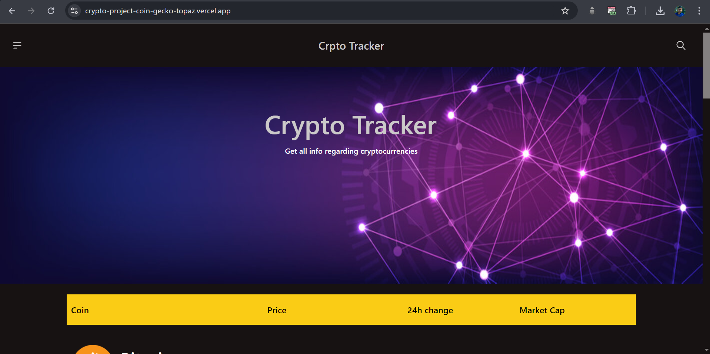
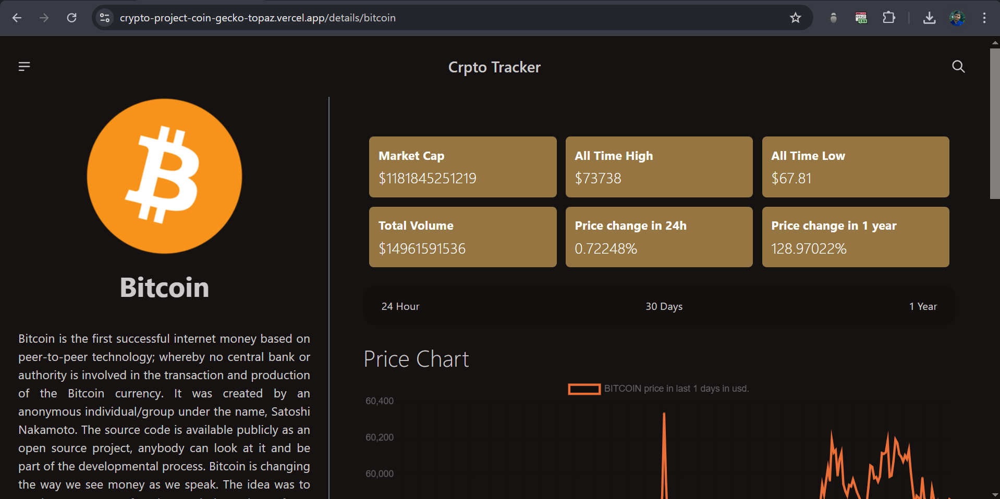

    
    <h1>Crypto Tracker</h1>

The Cryptocurrency Tracker App is a robust, user-friendly application built with React.js. It allows users to monitor real-time cryptocurrency data, including prices, market caps, and more, using the CoinGecko API. The app offers a comprehensive view of various cryptocurrencies, making it an ideal tool for both casual users and serious investors.

<a style="font-size:1.5rem;" href="https://crypto-project-coin-gecko-topaz.vercel.app">Live Website</a>

## Features
- Home Page displays a table of cryptocurrencies with images, names, prices, 24-hour changes, and market cap.
- Currency Selector to toggle between USD and INR for displaying data.
- Pagination for browsing through an extensive list of cryptocurrencies.
- Detailed View available by clicking on a cryptocurrency, showing image, description, current price, and a dashboard with market cap, all-time high/low, total volume, and price changes over different periods.
- Interactive Charts displaying price, market cap, and volume data over 24 hours, 30 days, and one year.
- Reusable Components built using the presenter-container pattern for maintainable code.
- Custom Hooks implemented for reusable logic.
- State Management handled by Zustand.
- API Caching done using React Query.
- Responsive Design powered by DaisyUI.
- Performance Optimization with features like lazy loading, suspense, and error boundaries.

## Preview
**Home Page**

**Coin Detail Page**

## Getting Started

### Installation
1. Clone the repository: 
   `git clone https://github.com/ManikMaity/Crypto-Project---CoinGecko.git` 
   `cd Crypto-Project---CoinGecko`
   

2. Install the dependencies: 
   `npm install`
   

3. Start the development server: 
   `npm run dev`
   

4. **Access the app**:
   Open your browser and navigate to `http://localhost:5173` to start using the app.

## Usage
- Use the currency selector in the navbar to toggle between USD and INR.
- Browse through the list of cryptocurrencies on the homepage.
- Click on any cryptocurrency to view detailed information and interactive charts.
- Toggle between different time frames (24 hours, 30 days, one year) on the charts.
